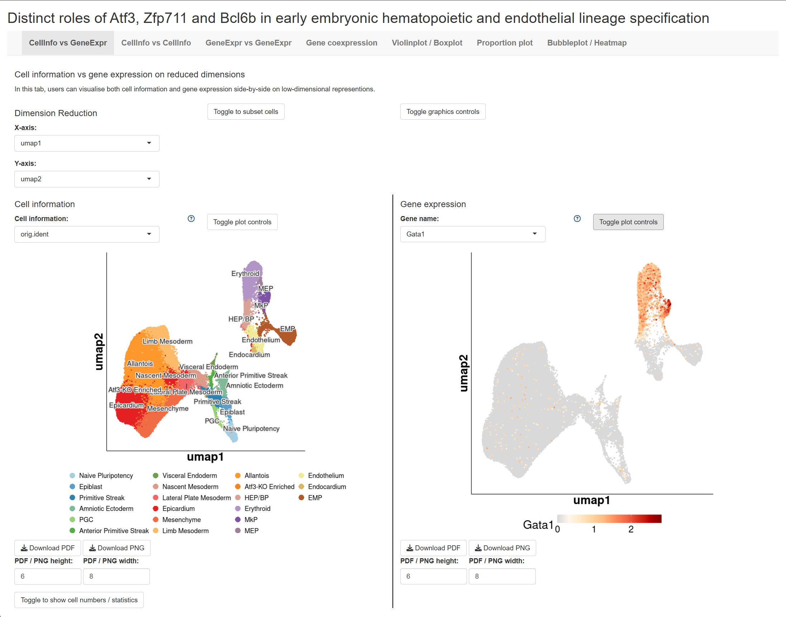
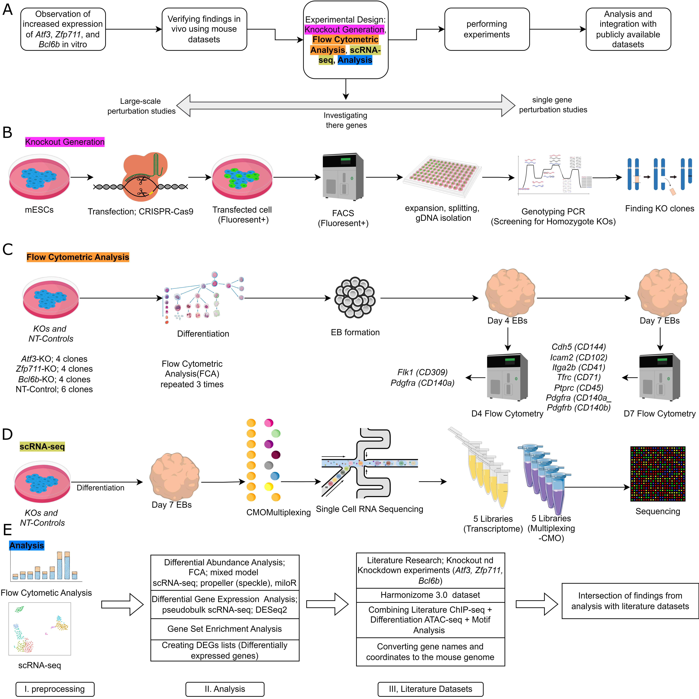
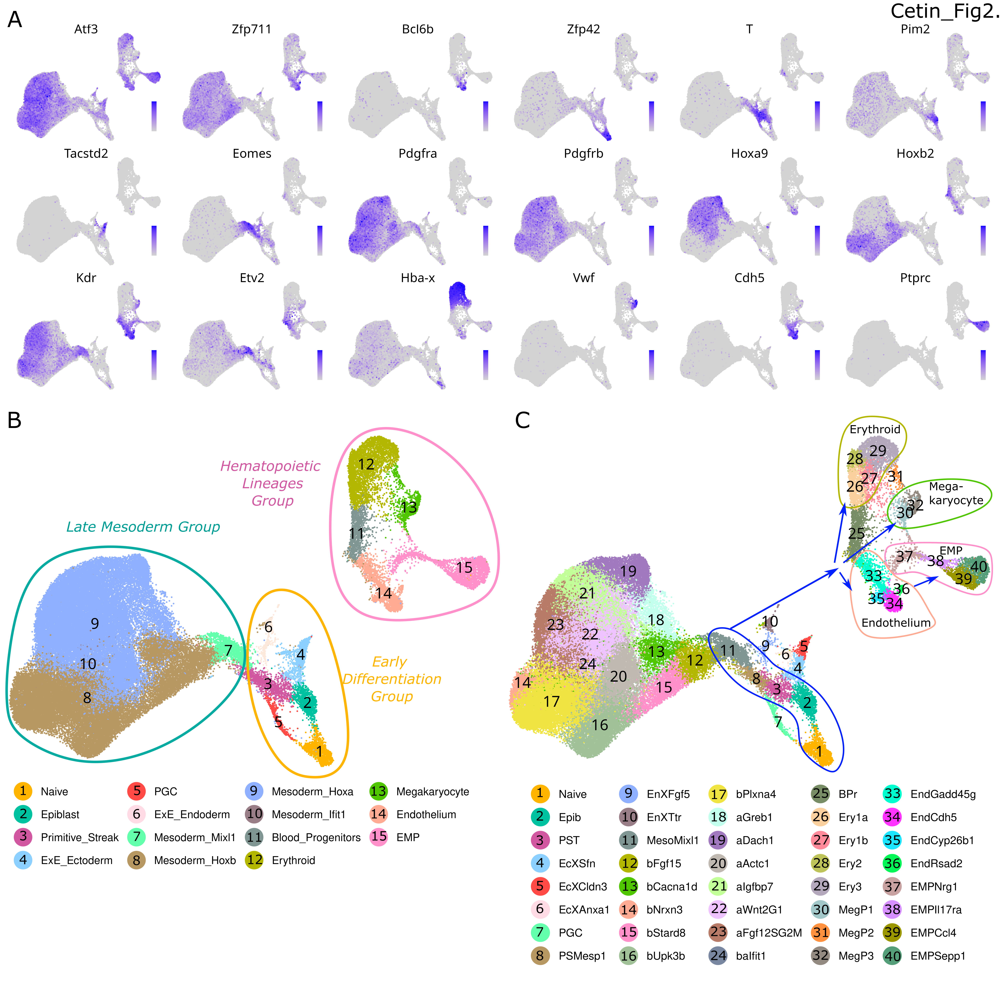

## Distinct Roles of Atf3, Zfp711, and Bcl6b in Early Embryonic Hematopoietic and Endothelial Lineage Specification

**Ridvan Cetin1, Giulia Picco1, Jente van Staalduinen1, Eric Bindels2, Remco Hoogenboezem2, Gregory van Beek2, Mathijs Sanders2, Yaren Fidan1, Ahmet Korkmaz3, Joost Gribnau1,4, Jeffrey van Haren1, Danny Huylebroeck1, Eskeatnaf Mulugeta1, Frank Grosveld1,***

---

### Table of Contents

1. [Abstract and Article References](#abstract)
2. [Data Availability](#data)
3. [Explore the Data](#explore)
4. [Code Availability](#code)
5. [Contact](#contact)
6. [Supporting Data](#supportdata)
7. [Workflow and Cell Types](#workflow)

---

### Abstract & Article References 

#### Abstract

Hematopoiesis occurs in three consecutive overlapping waves in mammals, regulated by transcription factors. We investigated the role of three relatively poorly studied transcription factors in early embryonic hematopoietic development at single-cell resolution: **Atf3**, **Zfp711** and **Bcl6b**. These transcription factors are upregulated early in development when hematopoietic and endothelial lineages separate from cardiac and other mesodermal lineages. We combined multiplexed single-cell RNA sequencing and flow cytometric analysis with knockouts in in vitro differentiating mouse embryonic stem cells to dissect the function of these transcription factors in lineage specification.

**Key Findings:**

- **ΔAtf3** cells showed increased mesodermal differentiation but decreased endothelial cells and erythro-myeloid progenitors, accompanied by aberrant interferon signaling. Mechanistically, loss of Atf3 disrupted key hematopoietic regulators (Runx1, Egr1, Jun, Fos, Mafb, Batf3) required for erythro-myeloid progenitors' formation.

- **ΔZfp711** cells exhibited increased blood progenitors and erythroid cells but decreased endothelial cells, with a striking shift from Hoxa+ mesoderm (allantois, limb-mesoderm) to Hoxb+ mesoderm (mesenchyme, epicardium). Notably, Zfp711 binds the Atf3 promoter, suggesting a hierarchical regulation.

- **ΔBcl6b** had no observable effects on early hematopoiesis despite specific expression in hemato-endothelial progenitors.

#### Article References

**Development (Published)**

Ridvan Cetin, Giulia Picco, Jente van Staalduinen, Eric Bindels, Remco Hoogenboezem, Gregory van Beek, Mathijs A. Sanders, Yaren Fidan, Ahmet Korkmaz, Joost Gribnau, Jeffrey van Haren, Danny Huylebroeck, Eskeatnaf Mulugeta, Frank Grosveld; *Distinct Roles of Atf3, Zfp711, and Bcl6b in Early Embryonic Hematopoietic and Endothelial Lineage Specification.* **Development** 2025; 152(23): dev204792.  
DOI: [https://doi.org/10.1242/dev.204792](https://doi.org/10.1242/dev.204792)

**bioRxiv (Preprint)**

Ridvan Cetin, Giulia Picco, Jente van Staalduinen, Eric Bindels, Remco Hoogenboezem, Gregory van Beek, Mathijs A Sanders, Yaren Fidan, Ahmet Korkmaz, Joost Gribnau, Jeffrey van Haren, Danny Huylebroeck, Eskeatnaf Mulugeta, Frank Grosveld; *Single-Cell Roadmap of Early Hemato-Endothelial Development: Functions of Atf3, Zfp711 and Bcl6b.* **bioRxiv** 2025.02.23.639715.  
DOI: [https://doi.org/10.1101/2025.02.23.639715](https://doi.org/10.1101/2025.02.23.639715)

---

### Data Availability 

scRNA-seq data generated in this study have been deposited in the European Nucleotide Archive (ENA) database under accession number **E-MTAB-14678**:  
[https://www.ebi.ac.uk/biostudies/arrayexpress/studies/E-MTAB-14678](https://www.ebi.ac.uk/biostudies/arrayexpress/studies/E-MTAB-14678)

**UCSC Browser Sessions:**
- [hg38_ATF3](https://genome.ucsc.edu/s/mdrcetin/hg38_ATF3)
- [mm10_Atf3](https://genome.ucsc.edu/s/mdrcetin/mm10_Atf3)
- [mm10_Zfp711](https://genome.ucsc.edu/s/mdrcetin/mm10_Zfp711)
- [hg19_ZNF711](https://genome.ucsc.edu/s/mdrcetin/hg19_ZNF711)
- [hg38_ZNF711](https://genome.ucsc.edu/s/mdrcetin/hg38_ZNF711)

The data supporting the findings of this study are available from the corresponding author upon reasonable request.

---

### Explore the Data 

#### Interactive Shiny App

Explore the single-cell RNA-seq data interactively: **[Launch Shiny App](https://ridvan.shinyapps.io/shinyapp/)**

---

### Code Availability 

All analysis code is available in the [GitHub repository](https://github.com/ridvan-cetin/CMO_Atf3_Zfp711_Bcl6b). Scripts are provided in two versions:
- **`Organized/`** — Annotated scripts with detailed documentation (recommended)
- **`Original_code/`** — Original scripts as used during analysis

#### Analysis Pipeline

| Step | Script | Description |
|------|--------|-------------|
| **1** | [code_001_demultiplexing.Rmd](https://github.com/ridvan-cetin/CMO_Atf3_Zfp711_Bcl6b/blob/main/Organized/code_001_demultiplexing.Rmd) | Demultiplexes pooled scRNA-seq samples using CMO with deMULTIplex2 |
| **2** | [code_002_preprocessing.Rmd](https://github.com/ridvan-cetin/CMO_Atf3_Zfp711_Bcl6b/blob/main/Organized/code_002_preprocessing.Rmd) | QC filtering, normalization, PCA/UMAP, and Leiden clustering |
| **3** | [code_003_DAA_speckle.Rmd](https://github.com/ridvan-cetin/CMO_Atf3_Zfp711_Bcl6b/blob/main/Organized/code_003_DAA_speckle.Rmd) | Differential abundance analysis using speckle (beta-binomial regression) |
| **4** | [code_004_DAA_miloR.Rmd](https://github.com/ridvan-cetin/CMO_Atf3_Zfp711_Bcl6b/blob/main/Organized/code_004_DAA_miloR.Rmd) | Neighborhood-based differential abundance analysis using MiloR |
| **5** | [code_005_DGEA_DESeq2.Rmd](https://github.com/ridvan-cetin/CMO_Atf3_Zfp711_Bcl6b/blob/main/Organized/code_005_DGEA_DESeq2.Rmd) | Differential gene expression analysis using DESeq2 pseudobulk |
| **6** | [code_006_unique_clustermarkers.Rmd](https://github.com/ridvan-cetin/CMO_Atf3_Zfp711_Bcl6b/blob/main/Organized/code_006_unique_clustermarkers.Rmd) | Cluster-specific marker gene identification |
| **7** | [code_007_GSEA.Rmd](https://github.com/ridvan-cetin/CMO_Atf3_Zfp711_Bcl6b/blob/main/Organized/code_007_GSEA.Rmd) | Gene Set Enrichment Analysis using clusterProfiler |
| **8** | [code_008_FCA_Statistics.Rmd](https://github.com/ridvan-cetin/CMO_Atf3_Zfp711_Bcl6b/blob/main/Organized/code_008_FCA_Statistics.Rmd) | Flow cytometry statistical analysis with mixed-effects models |
| **9** | [code_009_DEGs_categorization.Rmd](https://github.com/ridvan-cetin/CMO_Atf3_Zfp711_Bcl6b/blob/main/Organized/code_009_DEGs_categorization.Rmd) | DEG categorization (shared vs unique across KO conditions) |
| **10** | [code_010_CMO_mapping_1.ipynb](https://github.com/ridvan-cetin/CMO_Atf3_Zfp711_Bcl6b/blob/main/Organized/code_010_CMO_mapping_1.ipynb) | Cell type mapping to Mouse Gastrulation Atlas |
| **11** | [code_011_Slingshot_atlas_1.ipynb](https://github.com/ridvan-cetin/CMO_Atf3_Zfp711_Bcl6b/blob/main/Organized/code_011_Slingshot_atlas_1.ipynb) | Slingshot trajectory inference on Atlas |
| **12** | [code_012_Atf3_FACS.ipynb](https://github.com/ridvan-cetin/CMO_Atf3_Zfp711_Bcl6b/blob/main/Organized/code_012_Atf3_FACS.ipynb) | FACS visualization for Atf3-KO |
| **13** | [code_013_Palantir_Part1.ipynb](https://github.com/ridvan-cetin/CMO_Atf3_Zfp711_Bcl6b/blob/main/Organized/code_013_Palantir_Part1.ipynb) | Palantir pseudotime analysis |
| **14** | [code_014_EMP_TFs_.ipynb](https://github.com/ridvan-cetin/CMO_Atf3_Zfp711_Bcl6b/blob/main/Organized/code_014_EMP_TFs_.ipynb) | EMP-specific transcription factor identification |
| **15** | [code_015_figs.Rmd](https://github.com/ridvan-cetin/CMO_Atf3_Zfp711_Bcl6b/blob/main/Organized/code_015_figs.Rmd) | Publication figure generation |

See the [full code documentation](https://github.com/ridvan-cetin/CMO_Atf3_Zfp711_Bcl6b#analysis-codes) for additional scripts including cell type renaming, FACS visualization for all conditions, and utility functions.

---

### Contact 

**Ridvan Cetin**  
Department of Cell Biology, Erasmus University Medical Center Rotterdam

- Email: [r.cetin@erasmusmc.nl](mailto:r.cetin@erasmusmc.nl)
- Email: [mdrcetin@gmail.com](mailto:mdrcetin@gmail.com)

---

### Supporting Data 

- [Flow Cytometric Analysis Data](https://github.com/ridvan-cetin/CMO_Atf3_Zfp711_Bcl6b/tree/main/FlowCytometricAnalysis_data)

---

### Workflow and Cell Types 

#### Experimental Workflow

#### Cell Type Annotations

---

###### Affiliations

1 Department of Cell Biology, Erasmus University Medical Center Rotterdam, Rotterdam, The Netherlands

2 Department of Hematology, Erasmus University Medical Center Rotterdam, Rotterdam, The Netherlands

3 Medical Faculty, Institute of Physiology, RWTH Aachen University, Aachen, Germany

4 Department of Developmental Biology, Erasmus University Medical Center Rotterdam, Rotterdam, The Netherlands

* Corresponding author

---

*The design of this page was inspired by [https://marionilab.github.io/ExtendedMouseAtlas/](https://marionilab.github.io/ExtendedMouseAtlas/)*
